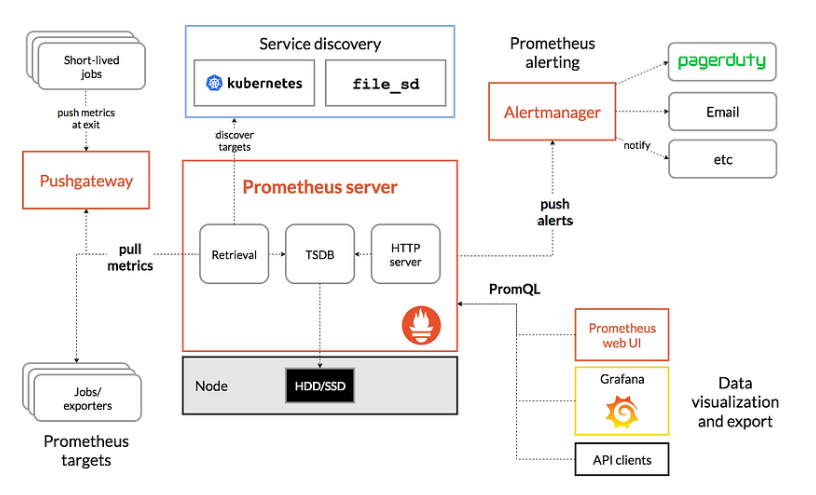

# Jentis-Project
We are adding logging tools as well as monitoring tools like Prometheus and Grafana while launching a basic microservice in Kubernetes.

# Goals of our Project:
 - In a Kubernetes environment, we are deploying a basic microservice.

 - Access the application inside and outside our cluster
 - Keep an eye on the health of our cluster, transmit logs, and create alarms for it.
 - Obtain logs of our cluster ie nodes, pods etc

 

### Prerequisite for this project :

- Docker  - *A containerization tool for deploying light  weigh applications*.
- Minikube - *A local container orchestration tool or local kubernetes*.
- Helm Chart - *A powerful  package manager tool that contains all the necessary resources to deploy an application to a Kubernetes cluster.*
- Kubectl - *Kubectl is a command line tool used to run commands against Kubernetes clusters.*
- Prometheus & Grafana - *Prometheus is an open-source monitoring system that collects and stores metrics from various sources, such as servers, applications, and devices. It allows users to create alerts and visualizations based on the collected metrics. Grafana is an open-source data visualization and analytics platform that allows users to create interactive dashboards and visualizations of their metrics.*

  
  Beginning of this project I will install `docker` `minikube` `helm chart` `kubectl` from their various website and repo.

  - For docker you can find the link here ✨[Docker](https://docs.docker.com/engine/install/ubuntu/)
  - For Minikube, one can use this  ✨[Minikube](https://minikube.sigs.k8s.io/docs/start/)
  - Also for Helm chart a link you can use is ✨ [Helm](https://helm.sh/docs/intro/using_helm/)
  - kubectl can be installed by using the minikube installion of from here ✨[kubectl](https://kubernetes.io/docs/tasks/tools/install-kubectl-linux/)

## STEPS 1. Deploying our App & a LoadBalancer

- To execute our deployment, we will create our Node.js Docker image and push it to Dockerhub.

1. With the following command, I will set up my docker to have the sudo group and users:  `sudo usermod -aG docker $USER && newgrp docker`.

    Once this is resolved, we won't have any errors or permission refused when we launch our *docker* and *minikube*.

  2. The following action is to launch our minikube with the command `minikube start`, which ought to launch our local Kubernetes.  
  
  
        Using `minikube start` and `minikube dashboard`, we can verify that everything is configured and operational. If everything is satisfactory, we can proceed to install our `kubectl`.

        

  3. We can use the  link above to install our kubectl swiftly.

  - Once all of these are set up and installed, we can use the commands `kubectl apply -f (manifest.yml files)`  in our yaml file to launch our basic `node js application`, which will generate our *pods* and *services* in our cluster.
   
      - A brief note before we continue: *A cluster's basic building component, a pod is a collection of one or more containers with shared networking and storage.*  
   
      - Now that we are aware of what a pod is, let's talk about services. *A service is a network service that exposes an application that is executing on a group of pods.*

    Using `kubectl get all`, we can verify whether our pods and services within our cluster are operational. Because this cluster is still not ready for production.
    
    

    Also Using the command `minikube service nodeapp-service`, we should access our application through a LoadBalancer by populating our service IP of our application. This will allows us to access our application from outside of the cluster.
    
    
    
    This can also be achieved using the portforwarding to access our application outside the cluster, which can be is a fairly straightforward method too. Have a look below .

    
   
    To access our application in our cluster we can use this command `curl  https://service IP:Port ` We got this from using this command `minikube service nodeapp-service`

    

    And you can see we have our application up and ready.

#### Our application is now running in a Kubernetes environment, which enables us to scale up and down as needed. 

## STEP 2 - Setting Up A Monitoring Tool Using Grafana and Prometheus.

Prerequisite:
 
- Helm chart
- Prometheus
- Grafana

Come on, let's go ahead. As previously mentioned, Prometheus is an open-source monitoring tool that gathers and saves information from multiple sources, including our `Application`. Grafana gives us access to interactive dashboards and visualizations of our Prometheus metrics.

We will go ahead and up install prometheus following this link [Prometheus](https://github.com/prometheus-community/helm-charts/)

 1. The Helm Stable Charts must be included for your local client. Run the following command. 
 
    `helm repo add stable https://charts.helm.sh/stable`
    
    This will add helm in our local client or virtual server
2. Add the Prometheus Repo using this command 

     `  helm repo add prometheus-community https://prometheus-community.github.io/helm-charts`
3. We can search for the prometheus repo using this command:

    `helm search repo prometheus-community`
   
    
4. To make it easier to sort pods and other resources, we will use this command to create a namespace for our Prometheus, note that namespaces are a method by which a single cluster used by an organization can be divided and categorized into multiple sub-clusters and managed individually 

    `kubectl create namespace prometheus`

5. We can install our *prometheus-stack* as soon as our namespace is created because it already has Grafana included, thus we won't need to install Grafana separately. The installation command for it is:
 

    `helm install  prometheus-community/kube-prometheus-stack -n prometheus`

    We can now see this is deployed successfully. 
    

  6. The next step is to use the commands:
    
      `kubectl get pods -n prometheus` and `kubectl get svc -n prometheus`  to check if the pods and svc services are running. This will show us that the pods and svc are operating. 
     Look down below
    :

  7. Prometheus and Grafana can be accessed from outside the cluster by substituting a LoadBalancer or NodePort for the ClusterIP. This command will be used.

     `kubectl expose service prometheus-operated --type=NodePort --target-port=9090 --name=prometheus-server-external` 
 
      This allows us to access our Prometheus from outside of our cluster. We'll use this command to accomplish the same for our grafana. 

  
     `kubectl expose service stable-grafana --type=NodePort --target-port=3000 --name=grafana-externals`

      This will enable us to access Grafana and Prometheus beyond our cluster.

 8. Let's have a look at our prometheus running outside our cluster. 
 
    

    - We've managed to successfully access our prometheus outside of our cluster, which is a significant milestone for cluster monitoring.
    - We verify our endpoint using the prometheus user interface, target, logs, and metrics displayed in tables and graphs.
 
    
         
    - Check our metrics in a graph

9. Let's use the URL from our svc of our stable-grafana with the port forwarded to access our Grafana as well. Check out our grafana available below.

     
    Voila! we can access our grafana. 

    Our next step is to dive in, to configure our user name and password.
    using these commands:

    `kubectl get secret --namespace prometheus stable-grafana -o yaml`
    
    This will show us our `username` and `password` encryted. Our next step is to decrypt it. Image below

- One can encrypt the username and password using this
    
         `echo "<admin value>" | openssl base64 -d ;  echo` and `echo "<admin-password value>" | openssl base64 -d ;  echo`.

    With this done we can login into our Grafana UI and configure it.
    
    

   We can monitor our cluster and configure our Prometheus using such a lovely UI dashboard.

10. By selecting Add Your Data Source from the Grafana landing page, we will now add our data source from Prometheus and set it up to have access using Prometheus `{PublicIP:Port}`. We can now set an alert for our cluster in Kubernetes and develop a nice dashboard for our Prometheus after completing this.
 

    For creating a dashboard to monitor the cluster:

    Click '+' button on left panel and select ‘Import’.

    Enter 6417 dashboard id under Grafana.com Dashboard.

    Click ‘Load’.

    Select ‘Prometheus’ as the endpoint under prometheus data sources drop down.

    Click ‘Import'

This [Grafana](https://grafana.com/grafana/dashboards/6417-kubernetes-cluster-prometheus/) dashboard
can be used for our K8 Cluster (Prometheus) dashboard. We can now see our dashboard changed.

For creating a dashboard to monitor the pod:

Click '+' button on left panel and select ‘Import’.

Enter 6417 dashboard id under Grafana.com Dashboard.

Click ‘Load’.

Select ‘Prometheus’ as the endpoint under prometheus data sources drop down.

Click ‘Import’.

As you can see, I've set up an alert for my memory consumption and information. These alerts will be delivered to our Slack channel, Pagerduty, etc., helping us to wrap up our project.

Now let's approach it this way: now that our Kubernetes cluster is operational, how will we identify and resolve issues if one arises with a specific pod-specified namespace?

We plan to employ the logging mechanism to obtain complete information about our pods, nodes, and cluster as a whole

If you have a namespace, we will use the following command to accomplish this: `kubectl describe pod -n <namespace name>.`  Use `kubectl log pod` or `kubectl describe pod` to fill in our pods' logs if you don't have a namespace.

We can also obtain the logs of our node, which in this case is minikube, by running the following command: `kubectl describe node minikube`.

We have access to external logging tools such as Elasticsearch, New Relic, and EFK. Let's continue with our native Kubernetes logging, and don't forget that we can also log from Prometheus and Grafana.

To the very end, I truly appreciate your involvement.
